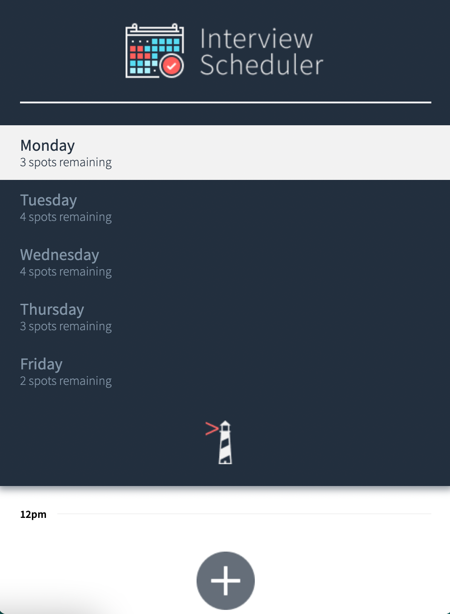

Interview Scheduler

The purpose of Interview Scheduler is to allow users to book appointments with a chosen day, time, and interviewer. When creating, editing or deleting appointments, and the app will dynamically update and display the number of spots left in a day.


To run application

```bash
npm install
npm run start
```

To reset database

```bash
http://localhost:8001/api/debug/reset
```
Demo

<video width="900" height="500" controls>
  <source src="Interview_Scheduler_Demo.mov" type="video/mp4">
</video>


Mobile View
